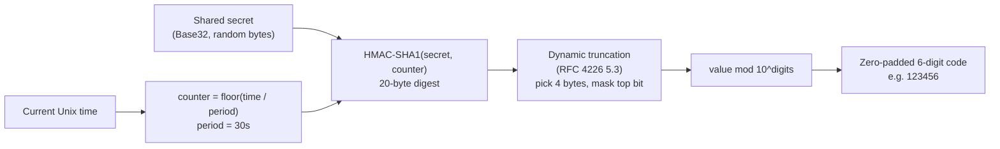
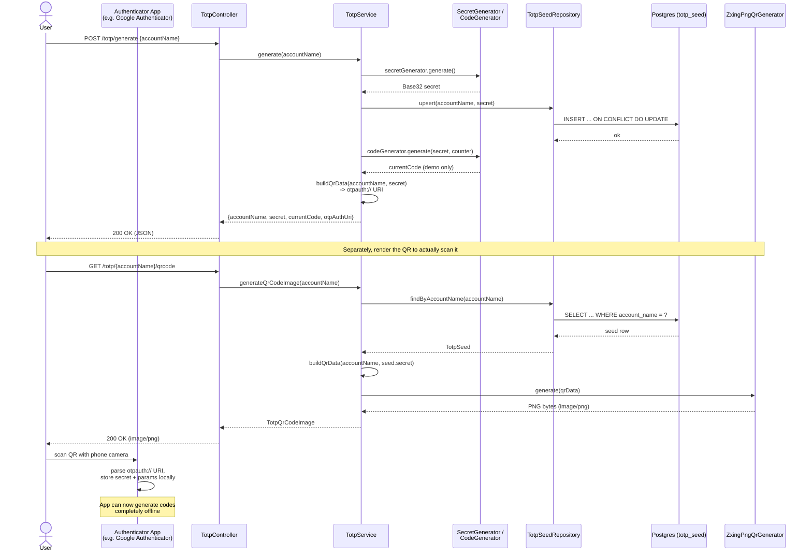
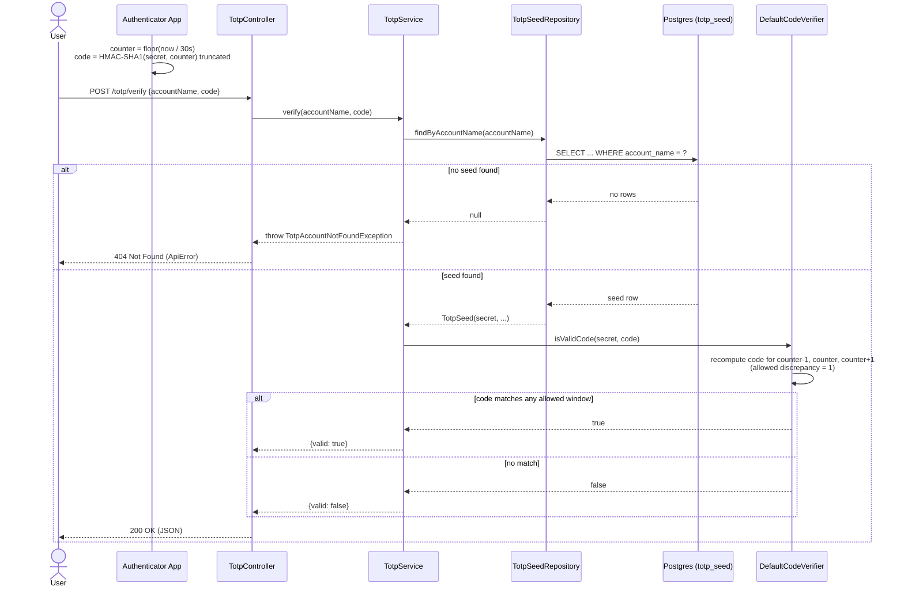

# <span style="color:hsl(84,80%,58%)">learning-utility</span>


A small Spring Boot application bundling **three independent demo REST APIs** behind one process:

<ul>

- **`com.learning.qr`** — generic QR code generation and decoding, backed by ZXing.
- **`com.learning.totp`** — RFC 6238 time-based one-time password (TOTP) generation and
  verification for two-factor authentication (2FA), backed by `dev.samstevens.totp`, with the
  secret persisted in Postgres.
- **`com.learning.notification`** — Apple Push Notification service (APNs) delivery, backed by
  the Pushy client library.

</ul>

These three packages are **not wired together**. The README below goes deep on *why* and *how*
each one works — this is meant to double as a technical explainer of TOTP-based 2FA and QR code
mechanics, illustrated with the actual code in this repository, not just a quick-start.

> **A note on scope, read carefully:** it would be natural to assume a demo combining TOTP and
> push notifications sends a push alert on a failed 2FA attempt ("someone tried your code and got
> it wrong"). **This repo does not do that.** `TotpService.verify(...)` never calls
> `NotificationService`, and there is no event, listener, or shared code path between
> `com.learning.totp` and `com.learning.notification` at all — grep the source and the only shared
> ancestor is `com.learning.common.web.GlobalExceptionHandler`, which just maps exceptions from
> both packages to the same JSON error shape. Push notifications here are a standalone APNs demo
> that happens to live in the same Maven module. If you want failed-attempt alerting, it is not
> implemented — see the "Notification module" section below for what actually exists.

Request/response DTOs for all three packages (plus the shared `ApiError` shape) are **generated at
build time** from OpenAPI specs under `src/main/resources/openapi/` via
`openapi-generator-maven-plugin` (generator: `spring`, models only, no controller interfaces) —
they are not hand-written. Controllers and services are hand-written and reference the generated
classes directly.

---

## <span style="color:hsl(222,80%,58%)">Table of contents</span>

1. 🧰 [Tech stack](#tech-stack)
2. 🏗️ [Architecture at a glance](#architecture-at-a-glance)
3. 🚀 [Deep dive: how TOTP actually works](#deep-dive-how-totp-actually-works)
4. 🔹 [How this repo implements TOTP](#how-this-repo-implements-totp)
5. 💡 [Deep dive: QR codes and how they're used here](#deep-dive-qr-codes-and-how-theyre-used-here)
6. 🏗️ [The notification module: what it really is](#the-notification-module-what-it-really-is)
7. 🔹 [Sequence diagrams](#sequence-diagrams)
8. 🏗️ [Project structure](#project-structure)
9. 📚 [API reference](#api-reference)
10. 🤖 [Data model](#data-model)
11. ⚠️ [Error handling](#error-handling)
12. 🚀 [Running](#running)
13. 🧪 [Testing](#testing)
14. 📚 [Configuration reference](#configuration-reference)

---

<a id="tech-stack"></a>
## <span style="color:hsl(359,80%,58%)">1. 🧰 Tech stack</span>

| Concern            | Technology                                                                                                                        |
|--------------------|-----------------------------------------------------------------------------------------------------------------------------------|
| Language           | Java 25                                                                                                                           |
| Framework          | Spring Boot 4.1.0, Spring MVC                                                                                                     |
| QR encode/decode   | ZXing (`com.google.zxing:core` + `javase`)                                                                                        |
| TOTP               | `dev.samstevens.totp:totp` (itself uses ZXing internally for QR rendering)                                                        |
| Push notifications | `com.eatthepath:pushy` (APNs HTTP/2 client, token-based `.p8` auth)                                                               |
| Persistence        | Spring JDBC (`JdbcTemplate`) + PostgreSQL + Flyway                                                                                |
| API docs           | springdoc-openapi (Swagger UI)                                                                                                    |
| Model generation   | `openapi-generator-maven-plugin` (generator: `spring`, models only)                                                               |
| Build              | Maven — parent `com.org.llm:super-pom`; no dependency versions are hardcoded in this module's `pom.xml` except `pushy` (`0.15.6`) |

---

<a id="architecture-at-a-glance"></a>
## <span style="color:hsl(137,80%,58%)">2. 🏗️ Architecture at a glance</span>

The three packages share nothing except the top-level Spring Boot application class and the
common exception-handling advice. There is no service-to-service call anywhere in the codebase.

```mermaid
graph TB
    subgraph "com.learning.qr — generic QR codes"
        QRC[QrCodeController<br/>/qr/generate, /qr/scan]
        QRS[QrCodeService]
        QRC --> QRS
        QRS -->|encode| ZXW[ZXing QRCodeWriter]
        QRS -->|decode| ZXR[ZXing MultiFormatReader]
    end

    subgraph "com.learning.totp — RFC 6238 TOTP / 2FA"
        TC[TotpController<br/>/totp/generate, /totp/verify,<br/>/totp/{account}/qrcode]
        TS[TotpService]
        TR[TotpSeedRepository]
        TC --> TS
        TS --> TR
        TR --> PG[(Postgres<br/>totp_seed)]
        TS -->|SecretGenerator| SEC[Base32 secret]
        TS -->|CodeGenerator / CodeVerifier| HMAC[HMAC-SHA1 HOTP core]
        TS -->|ZxingPngQrGenerator| ZXW2[ZXing, wrapped by<br/>dev.samstevens.totp]
    end

    subgraph "com.learning.notification — APNs push"
        NC[NotificationController<br/>/notifications/send]
        NS[NotificationService]
        AC[ApnsClientConfig<br/>conditional bean]
        NC --> NS
        NS --> AC
        AC -->|token-based .p8 auth| APNS[(Apple Push<br/>Notification service)]
    end

    GEH[GlobalExceptionHandler<br/>shared @RestControllerAdvice]
    QRC -. exceptions .-> GEH
    TC -. exceptions .-> GEH
    NC -. exceptions .-> GEH

    style GEH fill:#4a4a4a,color:#fff
```

No arrows cross between the three subgraphs above except through the shared exception handler —
that is intentional and reflects the real code, not a simplification.

---

<a id="deep-dive-how-totp-actually-works"></a>
## <span style="color:hsl(274,80%,58%)">3. 🚀 Deep dive: how TOTP actually works</span>

TOTP (Time-based One-Time Password, [RFC 6238](https://datatracker.ietf.org/doc/html/rfc6238)) is
the algorithm behind the 6-digit codes in apps like Google Authenticator, Authy, and 1Password's
built-in authenticator. It is a straightforward extension of **HOTP** (HMAC-based One-Time
Password, [RFC 4226](https://datatracker.ietf.org/doc/html/rfc4226)) where the ever-incrementing
"counter" is replaced by the current time, divided into fixed windows.

### <span style="color:hsl(52,80%,50%)">The building blocks</span>

1. **A shared secret.** At enrollment, the server generates a random secret (this repo uses a
   Base32-encoded value, e.g. `JBSWY3DPEHPK3PXP`) and both the server and the user's authenticator
   app end up holding an identical copy. Base32 is used because it is the encoding the `otpauth://`
   URI standard expects, and it is easy for a human to type by hand if QR scanning isn't available.
2. **A time step (period).** Time is divided into fixed-size windows, conventionally 30 seconds.
   Instead of a counter that increments by 1 on every use (as in HOTP), TOTP derives the counter
   from wall-clock time:

   ```
   counter = floor(current_unix_time / period)
   ```

   Because both the server and the phone read from (roughly) the same clock, they compute the
   same counter value without ever needing to communicate — this is what makes TOTP work offline,
   with no round-trip between the app and the server at code-generation time.
3. **HMAC.** The counter (as an 8-byte big-endian integer) is HMAC'd using the shared secret as
   the key. This repo, like most TOTP implementations, uses **HMAC-SHA1** (`HashingAlgorithm.SHA1`
   in `dev.samstevens.totp`) — SHA1 is still the de facto standard for TOTP interoperability with
   authenticator apps, even though SHA1 is considered weak for other purposes; its use here is
   purely as a keyed pseudorandom function, not for collision resistance, so it remains acceptable
   for this use case and is what nearly every authenticator app expects by default.
4. **Dynamic truncation.** The 20-byte HMAC-SHA1 digest is truncated down to a 4-byte integer using
   a scheme from RFC 4226: the low 4 bits of the last byte of the HMAC pick an offset into the
   digest, 4 bytes are read starting at that offset, and the top bit is masked off (to avoid sign
   ambiguity across platforms).
5. **Modulo reduction to digits.** The resulting 31-bit integer is reduced modulo `10^digits`
   (`10^6` here) and zero-padded to the requested digit count, producing the familiar 6-digit code.



### <span style="color:hsl(189,80%,58%)">Why verification tolerates clock drift</span>

Because the server and the authenticator app read their clocks independently, small drift (a few
seconds of NTP skew, or the delay between generating and typing a code) can push them into
adjacent time windows. Verifiers compensate by checking not just the current time step's code, but
also one or more adjacent steps ("allowed discrepancy" / "window"). This repo's verifier is
configured with a discrepancy of **1**, meaning it accepts a code that matches the previous, current,
or next 30-second window — an effective +/-30 second tolerance beyond the current window, so a code
is valid for up to ~90 seconds from generation in the best case and as little as ~30 seconds in the
worst case, depending on where in the window it was generated. This is a deliberate security/UX
trade-off: too narrow a window and legitimate users get rejected over minor clock skew; too wide
and you extend the practical replay window for an attacker who intercepts a code.

### <span style="color:hsl(327,80%,58%)">Enrollment vs. verification, conceptually</span>

<ul>

- **Enrollment** happens once: the server generates the secret, and the user's phone needs to
  receive an *exact copy* of that secret plus the algorithm parameters (issuer, digits, period,
  hash algorithm). The conventional way to transfer this without asking a human to transcribe a
  32-character Base32 string is a QR code encoding a `otpauth://totp/...` URI — see the
  [QR codes](#deep-dive-qr-codes-and-how-theyre-used-here) section below.
- **Verification** happens on every login: the user's app independently recomputes the code from
  its stored copy of the secret and the current time, the user types it in, and the server
  recomputes its own copy from *its* stored secret and compares. No secret material ever needs to
  travel over the network again after enrollment — this is what makes TOTP resistant to network
  sniffing in a way that, say, SMS codes are not.

</ul>

---

<a id="how-this-repo-implements-totp"></a>
## <span style="color:hsl(104,80%,58%)">4. 🔹 How this repo implements TOTP</span>

All TOTP logic lives in
[`TotpService`](src/main/java/com/learning/totp/service/TotpService.java), which wires together
four collaborators from `dev.samstevens.totp`:

```java
private final SecretGenerator secretGenerator = new DefaultSecretGenerator();
private final TimeProvider timeProvider = new SystemTimeProvider();
private final CodeGenerator codeGenerator = new DefaultCodeGenerator(HashingAlgorithm.SHA1, DIGITS);
private final CodeVerifier codeVerifier = buildCodeVerifier(); // DefaultCodeVerifier
private final QrGenerator qrGenerator = new ZxingPngQrGenerator();
```

with fixed parameters:

| Parameter                       | Value                                         |
|---------------------------------|-----------------------------------------------|
| `ISSUER`                        | `"learning-utility"`                          |
| `DIGITS`                        | `6`                                           |
| `PERIOD_SECONDS`                | `30`                                          |
| Hashing algorithm               | `HashingAlgorithm.SHA1`                       |
| Allowed time-period discrepancy | `1` (checks previous/current/next 30s window) |

### <span style="color:hsl(242,80%,58%)">Enrollment — `generate(accountName)`</span>

1. `secretGenerator.generate()` produces a fresh random Base32 secret via
   `DefaultSecretGenerator` — this is a cryptographically random byte sequence, not derived from
   the account name in any way.
2. `seedRepository.upsert(accountName, secret)` persists it. This is a Postgres
   `INSERT ... ON CONFLICT (account_name) DO UPDATE` — see
   [`TotpSeedRepository`](src/main/java/com/learning/totp/repository/TotpSeedRepository.java) — so
   **calling `/totp/generate` again for an account that already has a seed silently rotates the
   secret**, invalidating the old one and any authenticator app entry built from it. This mirrors
   real-world "reset my 2FA" flows, which are also destructive by nature.
3. The code valid *right now* is computed (`currentCode`) purely as a demo convenience — normally
   only the client-side authenticator app would compute this, never the server, since the whole
   point of TOTP is that the server never needs to originate a code.
4. A `QrData` object is built (label = account name, the secret, issuer, algorithm, digits,
   period) and its `.getUri()` — an `otpauth://` URI — is returned as `otpAuthUri`.
5. The full response (`accountName`, `secret`, `currentCode`, `otpAuthUri`) is returned once, at
   enrollment time only; there is no endpoint to retrieve the raw secret again later, only the QR
   re-render endpoint (below), which recovers the same secret from Postgres and rebuilds the same
   `otpauth://` URI from it.

### <span style="color:hsl(19,80%,58%)">Verification — `verify(accountName, code)`</span>

1. `seedRepository.findByAccountName(accountName)` looks up the persisted row; if none exists,
   `TotpAccountNotFoundException` is thrown (mapped to HTTP 404 by `GlobalExceptionHandler`).
2. `codeVerifier.isValidCode(seed.secret(), code)` — a `DefaultCodeVerifier` configured with
   `setTimePeriod(30)` and `setAllowedTimePeriodDiscrepancy(1)` — recomputes the expected code for
   the current time step and the +/-1 adjacent step(s) using the *same* `codeGenerator` used at
   enrollment, and compares against the supplied `code`.
3. The boolean result is returned as `{ "valid": true|false }`. Note this is not an exception path:
   a wrong code is a normal `valid: false` response, HTTP 200 — only an *unknown account* is an
   error (404). This means there's no built-in "N failed attempts locks the account" behavior; the
   endpoint is stateless per call.

### <span style="color:hsl(157,80%,58%)">QR re-render — `generateQrCodeImage(accountName)`</span>

Because enrollment only shows the secret/QR code once, `GET /totp/{accountName}/qrcode` lets you
re-render the *same* enrollment QR from the *already-persisted* secret, in case the first scan was
missed. It looks up the seed, rebuilds an identical `QrData` (same label/secret/issuer/algorithm/
digits/period as at generation time), and renders it via `ZxingPngQrGenerator.generate(...)`,
wrapping any `QrGenerationException` from the library in this repo's own
`TotpQrGenerationException` (mapped to HTTP 500).

### <span style="color:hsl(294,80%,58%)">Persistence — `TotpSeedRepository` and the `totp_seed` table</span>

Straight `JdbcTemplate`, no ORM. Schema (Flyway migration
[`V1__create_totp_seed.sql`](src/main/resources/db/migration/V1__create_totp_seed.sql)):

```sql
CREATE TABLE IF NOT EXISTS totp_seed (
    id           BIGSERIAL    PRIMARY KEY,
    account_name VARCHAR(100) NOT NULL UNIQUE,
    secret       VARCHAR(64)  NOT NULL,
    created_at   TIMESTAMPTZ  NOT NULL DEFAULT NOW()
);
```

<ul>

- `account_name` is unique — one seed per account, enforced at the database level, which is what
  makes the upsert-based rotation-on-re-enrollment behavior correct (there's exactly one row to
  conflict against).
- `findByAccountName` returns `null` (not an exception) when nothing is found — the service layer
  is the one that decides that's exceptional (`TotpAccountNotFoundException`), keeping the
  repository a dumb data-access layer.
- The domain type `TotpSeed` is a plain Java record (`id`, `accountName`, `secret`, `createdAt`) —
  intentionally hand-written rather than OpenAPI-generated, since it never crosses the HTTP
  boundary directly.
- `secret` is encrypted at rest: [`TotpSecretCipher`](src/main/java/com/learning/totp/crypto/TotpSecretCipher.java)
  AES-256-GCM encrypts before `upsert` and decrypts after `findByAccountName`, keyed by
  `totp.secret-encryption-key` (see [§14](#configuration-reference)). The repository only ever
  hands plaintext to its callers — the ciphertext never leaves this class.

</ul>

### <span style="color:hsl(72,80%,58%)">Auth and rate limiting on `/totp/**`</span>

Two gaps from an earlier version of this repo, now closed:

<ul>

- **Auth.** Every `/totp/**` endpoint used to take no identity check at all — anyone who knew an
  `accountName` could generate/verify/read the QR for it. [`SecurityConfig`](src/main/java/com/learning/config/SecurityConfig.java)
  now requires HTTP Basic auth on `/totp/**` (everything else — `/qr/**`, `/notifications/**`,
  Swagger — stays open). Read the javadoc on that class before assuming this is "solved": it's a
  single shared credential, not per-account authorization — the authenticated principal still
  isn't checked against the `accountName` in the request. A real deployment needs that additional
  check.
- **Rate limiting.** [`TotpVerifyRateLimiter`](src/main/java/com/learning/totp/service/TotpVerifyRateLimiter.java)
  tracks failed `/totp/verify` attempts per account in a sliding window and returns 429 after 5
  failures in 5 minutes — a 6-digit code is a 1e6 search space, so verification can't stay
  uncapped. It's in-process only (fine for this demo's single instance; a real multi-instance
  deployment needs a shared store).

</ul>

---

<a id="deep-dive-qr-codes-and-how-theyre-used-here"></a>
## <span style="color:hsl(209,80%,58%)">5. 💡 Deep dive: QR codes and how they're used here</span>

An `otpauth://` provisioning QR generated for this app (scan it with any authenticator):


A QR ("Quick Response") code is a 2D matrix barcode: a square grid of black/white modules encoding
binary data, plus fixed structural elements (the three large finder patterns in three corners, the
smaller alignment patterns, timing patterns, and format/version information) that let a scanner
locate, deskew, and determine the orientation and size of the code. Data can be encoded in several
modes (numeric, alphanumeric, byte, kanji) chosen automatically to minimize size, and the payload
is protected by Reed-Solomon error correction, which is why a QR code with a logo punched out of
its center, or one that's partly torn, is often still scannable — the redundancy tolerates a
configurable percentage of damaged modules.

This repo touches QR codes in two structurally separate places:

### <span style="color:hsl(347,80%,58%)">1. Generic QR encode/decode — `com.learning.qr`</span>

[`QrCodeService`](src/main/java/com/learning/qr/service/QrCodeService.java) has nothing to do with
TOTP; it's a standalone utility over raw ZXing:

<ul>

- **`decode(InputStream)`** — reads an uploaded image with `ImageIO`, wraps it as a ZXing
  `BufferedImageLuminanceSource` -> `HybridBinarizer` -> `BinaryBitmap`, and runs
  `MultiFormatReader.decode(...)` restricted to `BarcodeFormat.QR_CODE` via a decode hint. Returns
  the decoded text and format, or throws `QrDecodeException` (-> HTTP 400) if the image isn't
  readable or contains no QR code.
- **`generate(text, size)`** — encodes arbitrary text with ZXing's `QRCodeWriter` into a
  `BitMatrix`, then rasterizes it to a PNG via `MatrixToImageWriter`. `QrCodeController` enforces
  a size window of 100-1000px (`MIN_SIZE`/`MAX_SIZE`) and rejects empty text, both as
  `QrEncodeException` (-> HTTP 400).

</ul>

These two operations are exposed as `GET /qr/generate?text=...&size=...` and
`POST /qr/scan` (multipart file upload) — a general-purpose "make me a QR code" / "read me a QR
code" pair, independent of any TOTP concept. You could hand `/qr/generate` any string — a URL, a
Wi-Fi config, plain text — and it would happily encode it.

### <span style="color:hsl(124,80%,58%)">2. TOTP enrollment QR — `com.learning.totp`, via `dev.samstevens.totp`</span>

`TotpService` does **not** call `QrCodeService` — it uses `dev.samstevens.totp`'s own
`ZxingPngQrGenerator`, which internally wraps the same ZXing library but is purpose-built to render
a `QrData` object (the structured `otpauth://` URI) rather than arbitrary text. This is a small
but real architectural detail: the two QR code paths in this codebase share no Java code, only the
underlying ZXing dependency declared in `pom.xml`.

The payload encoded in the TOTP QR code is a URI in the (community-standardized, not IETF)
["Key URI Format"](https://github.com/google/google-authenticator/wiki/Key-Uri-Format) that Google
Authenticator popularized and most authenticator apps now support:

```
otpauth://totp/<label>?secret=<secret>&issuer=<issuer>&algorithm=SHA1&digits=6&period=30
```

<ul>

- `label` — the account name (e.g. `alice@example.com`), shown in the authenticator app's list.
- `secret` — the Base32 seed, exactly as persisted in `totp_seed.secret`.
- `issuer` — hardcoded to `learning-utility` in `TotpService.ISSUER`, shown alongside the account
  name in most apps to disambiguate multiple accounts with the same label.
- `algorithm`, `digits`, `period` — the same fixed parameters listed earlier, echoed into the URI
  so any compliant authenticator app configures itself identically to the server without the user
  entering anything manually.

</ul>

Scanning this QR code is what lets an authenticator app "enroll" without the user typing a 32-char
secret by hand — the phone camera reads the URI, the app parses out `secret`/`issuer`/`algorithm`/
`digits`/`period`, and from that point on computes codes completely offline using the same
HMAC-SHA1 derivation described above.

---

<a id="the-notification-module-what-it-really-is"></a>
## <span style="color:hsl(262,80%,58%)">6. 🏗️ The notification module: what it really is</span>

[`NotificationService`](src/main/java/com/learning/notification/service/NotificationService.java)
sends **Apple Push Notifications (APNs)** using the [Pushy](https://github.com/relayrides/pushy)
client library. It is a complete, independent demo of one thing: submitting an alert push to a
single iOS device token. It is not a generic "notify the user" abstraction and it is not consulted
anywhere in the TOTP flow.

### <span style="color:hsl(39,80%,58%)">Configuration and conditional wiring</span>

[`ApnsClientConfig`](src/main/java/com/learning/notification/config/ApnsClientConfig.java) only
constructs the `ApnsClient` bean when `apns.enabled=true` (`@ConditionalOnProperty`). When
disabled — the default (`APNS_ENABLED:false` in `application.yml`) — no bean exists, and
`NotificationService` receives it as an absent `Optional<ApnsClient>`:

```java
private final Optional<ApnsClient> apnsClient;
...
ApnsClient client = apnsClient.orElseThrow(() -> new NotificationConfigurationException(...));
```

This is a deliberate design choice noted directly in the class Javadoc: it lets the whole
application start up cleanly with no APNs credentials configured (useful for local dev of the
`qr`/`totp` endpoints), deferring the failure to first *use* of `/notifications/send`, rather than
failing application boot.

When enabled, the properties bound from `apns.*`
([`ApnsProperties`](src/main/java/com/learning/notification/config/ApnsProperties.java): `enabled`,
`signingKeyPath`, `teamId`, `keyId`, `topic`, `production`) are used to load a **token-based** `.p8`
signing key (`ApnsSigningKey.loadFromPkcs8File`) rather than the older certificate-based `.p12`
auth — tokens don't expire the way certificates do, which is why the comment in
`application.yml` calls this out explicitly. The client is pointed at Apple's development or
production APNs host depending on `apns.production`.

### <span style="color:hsl(177,80%,58%)">Sending a notification</span>

`NotificationService.send(deviceToken, title, body, badge)`:

1. Sanitizes the device token via `TokenUtil.sanitizeTokenString` (strips whitespace/angle
   brackets some client SDKs include).
2. Builds a JSON payload with `SimpleApnsPayloadBuilder` (`alert.title`, `alert.body`, `sound:
   "default"`, and an optional `badge` count if supplied).
3. Sends via `client.sendNotification(notification).get()` — **synchronous**, blocking the request
   thread on the Pushy future — and maps `InterruptedException`/`ExecutionException` to this
   repo's own `NotificationDeliveryException` (-> HTTP 502 via `GlobalExceptionHandler`).
4. Returns whether APNs accepted the notification, the APNs-assigned notification ID, and (when
   rejected) APNs' `rejectionReason` string (e.g. `BadDeviceToken`).

### <span style="color:hsl(314,80%,58%)">Why it's covered in this README at all</span>

It's a legitimate, self-contained piece of the codebase and worth understanding on its own terms
— but to be explicit about the boundary: nothing in `TotpService` or `TotpController` references
`NotificationService`, `ApnsClient`, or anything in `com.learning.notification`. A "send a push
when a 2FA verification fails" feature would be a genuine addition to this codebase, not something
that already exists and is just undocumented.

---

<a id="sequence-diagrams"></a>
## <span style="color:hsl(92,80%,58%)">7. 🔹 Sequence diagrams</span>

### <span style="color:hsl(229,80%,58%)">Enrollment flow — generate a secret, then scan it into an authenticator app</span>



### <span style="color:hsl(7,80%,58%)">Verification flow — user submits a code, server validates it against the time window</span>



---

<a id="project-structure"></a>
## <span style="color:hsl(144,80%,58%)">8. 🏗️ Project structure</span>

```
src/main/java/com/learning/
  qr/
    web/QrCodeController.java          GET /qr/generate, POST /qr/scan
    service/QrCodeService.java         ZXing encode + decode logic
    service/QrCodeImage.java           record: PNG bytes + MIME type
    exception/QrDecodeException.java
    exception/QrEncodeException.java

  totp/
    web/TotpController.java            POST /totp/generate, POST /totp/verify,
                                        GET /totp/{accountName}/qrcode
    service/TotpService.java           dev.samstevens.totp generate/verify + otpauth URI + QR render
    service/TotpQrCodeImage.java       record: PNG bytes + MIME type
    domain/TotpSeed.java               persisted row (hand-written, not OpenAPI-generated)
    repository/TotpSeedRepository.java JdbcTemplate, upsert-on-conflict
    exception/TotpAccountNotFoundException.java
    exception/TotpQrGenerationException.java
    exception/CodeGenerationFailedException.java

  notification/
    web/NotificationController.java    POST /notifications/send
    service/NotificationService.java   Pushy client usage, payload building
    config/ApnsClientConfig.java       conditional ApnsClient bean (apns.enabled=true)
    config/ApnsProperties.java         apns.* @ConfigurationProperties
    exception/NotificationConfigurationException.java
    exception/NotificationDeliveryException.java

  common/web/GlobalExceptionHandler.java   shared @RestControllerAdvice for all three packages

src/main/resources/
  openapi/
    common-api.yaml         -> generates com.learning.common.web.dto.ApiError
    qr-api.yaml              -> generates com.learning.qr.web.dto.QrDecodeResponse
    totp-api.yaml             -> generates com.learning.totp.web.dto.Totp*Request/Response
    notification-api.yaml    -> generates com.learning.notification.web.dto.Notification*Request/Response
  db/migration/V1__create_totp_seed.sql
  application.yml
```

---

<a id="api-reference"></a>
## <span style="color:hsl(282,80%,58%)">9. 📚 API reference</span>

### <span style="color:hsl(59,80%,50%)">QR module</span>

#### <span style="color:hsl(197,80%,58%)">`GET /qr/generate` — encode arbitrary text as a QR code PNG</span>

```bash
curl -s "http://localhost:8095/qr/generate?text=hello-world&size=300" -o qr.png
```

Returns `image/png`. `size` must be between 100 and 1000 (inclusive); `text` must not be empty.
Both violations return `400` with an `ApiError` body (`QrEncodeException`).

#### <span style="color:hsl(334,80%,58%)">`POST /qr/scan` — decode a QR code from an uploaded image</span>

```bash
curl -s -X POST http://localhost:8095/qr/scan -F "file=@/path/to/qr.png"
```

```json
{ "text": "https://example.com", "format": "QR_CODE" }
```

`400` if the file is empty, isn't a readable image, or contains no QR code (`QrDecodeException`).

### <span style="color:hsl(112,80%,58%)">TOTP module</span>

#### <span style="color:hsl(249,80%,58%)">`POST /totp/generate` — create and persist a new seed</span>

```bash
curl -s -X POST http://localhost:8095/totp/generate \
  -H "Content-Type: application/json" \
  -d '{"accountName": "alice@example.com"}'
```

```json
{
  "accountName": "alice@example.com",
  "secret": "JBSWY3DPEHPK3PXP",
  "currentCode": "123456",
  "otpAuthUri": "otpauth://totp/alice%40example.com?secret=JBSWY3DPEHPK3PXP&issuer=learning-utility&algorithm=SHA1&digits=6&period=30"
}
```

`secret` is stored in Postgres (`totp_seed` table, unique on `account_name`); calling `/generate`
again for the same account **rotates** the secret, invalidating anything already scanned into an
authenticator app. `currentCode` is the 6-digit code valid right now — included purely for demo
convenience (normally an authenticator app computes this from the `otpAuthUri`/secret on the
client side, not the server).

#### <span style="color:hsl(27,80%,58%)">`POST /totp/verify` — verify a code against the saved seed</span>

```bash
curl -s -X POST http://localhost:8095/totp/verify \
  -H "Content-Type: application/json" \
  -d '{"accountName": "alice@example.com", "code": "123456"}'
```

```json
{ "valid": true }
```

A wrong code is `200 { "valid": false }`, not an error. `404` (`ApiError`) only if no seed has
ever been generated for that account (`TotpAccountNotFoundException`).

#### <span style="color:hsl(164,80%,58%)">`GET /totp/{accountName}/qrcode` — render the enrollment URI as a scannable QR code</span>

```bash
curl -s http://localhost:8095/totp/alice@example.com/qrcode -o qr.png
```

Returns an `image/png` body — open `qr.png` and scan it with Google Authenticator/Authy to enroll
without typing the secret by hand. Built with `dev.samstevens.totp`'s `ZxingPngQrGenerator`
(itself backed by ZXing, the same library `com.learning.qr` uses to encode/decode, but invoked
through a separate code path — see the QR deep dive above). `404` if no seed exists yet for the
account.

### <span style="color:hsl(302,80%,58%)">Notification module</span>

#### <span style="color:hsl(79,80%,58%)">`POST /notifications/send` — send an Apple Push Notification to a device</span>

```bash
curl -s -X POST http://localhost:8095/notifications/send \
  -H "Content-Type: application/json" \
  -d '{
        "deviceToken": "740f4707bebcf74f9b7c25d48e3358945f6aa01da5ddb387462c7eaf61bb78a",
        "title": "New message",
        "body": "You have a new message from Alice.",
        "badge": 1
      }'
```

```json
{ "accepted": true, "apnsId": "9f595474-5fc7-4b45-a4a8-2a9d8ee1c4a0", "rejectionReason": null }
```

`deviceToken` must be a 64-character hex string. `503` (`ApiError`) if `apns.enabled=false` or no
`ApnsClient` bean exists (`NotificationConfigurationException`); `502` if APNs itself rejects the
request or the call fails at the network layer (`NotificationDeliveryException`).

---

An Insomnia collection covering all endpoints is at `insomnia-collection.json` (import it directly
— no auth/environment setup needed beyond the `baseUrl` variable, defaulted to
`http://localhost:8095`).

---

<a id="data-model"></a>
## <span style="color:hsl(217,80%,58%)">10. 🤖 Data model</span>

The only persisted state in the whole application is the `totp_seed` table (Flyway migration
`V1__create_totp_seed.sql`):

| Column         | Type           | Notes                                           |
|----------------|----------------|-------------------------------------------------|
| `id`           | `BIGSERIAL`    | primary key                                     |
| `account_name` | `VARCHAR(100)` | `NOT NULL UNIQUE` — one seed per account        |
| `secret`       | `VARCHAR(64)`  | `NOT NULL` — Base32-encoded TOTP secret         |
| `created_at`   | `TIMESTAMPTZ`  | `NOT NULL DEFAULT NOW()`, refreshed on rotation |

QR and notification endpoints are entirely stateless — nothing they touch is written to the
database.

---

<a id="error-handling"></a>
## <span style="color:hsl(354,80%,58%)">11. ⚠️ Error handling</span>

[`GlobalExceptionHandler`](src/main/java/com/learning/common/web/GlobalExceptionHandler.java) maps
every exception that escapes a controller, across all three packages, to a shared `ApiError` JSON
shape (`timestamp`, `status`, `error`, `message`):

| Exception                            | HTTP status                        | Module                   |
|--------------------------------------|------------------------------------|--------------------------|
| `MethodArgumentNotValidException`    | 400 Bad Request                    | shared (Bean Validation) |
| `QrDecodeException`                  | 400 Bad Request                    | qr                       |
| `QrEncodeException`                  | 400 Bad Request                    | qr                       |
| `TotpAccountNotFoundException`       | 404 Not Found                      | totp                     |
| `TotpQrGenerationException`          | 500 Internal Server Error (logged) | totp                     |
| `TotpRateLimitExceededException`     | 429 Too Many Requests              | totp                     |
| `NotificationConfigurationException` | 503 Service Unavailable            | notification             |
| `NotificationDeliveryException`      | 502 Bad Gateway (logged)           | notification             |
| anything else                        | 500 Internal Server Error (logged) | shared                   |

---

<a id="running"></a>
## <span style="color:hsl(132,80%,58%)">12. 🚀 Running</span>

```bash
docker compose up -d postgres
./mvnw spring-boot:run
```

Swagger UI: `http://localhost:8095/swagger-ui.html`

To exercise the notification endpoint for real you additionally need a valid APNs `.p8` signing
key and to set `APNS_ENABLED=true` plus `APNS_SIGNING_KEY_PATH`, `APNS_TEAM_ID`, `APNS_KEY_ID`,
`APNS_TOPIC` (and optionally `APNS_PRODUCTION=true`) — without those, the endpoint still starts up
fine and simply returns `503` on every call.

---

<a id="testing"></a>
## <span style="color:hsl(269,80%,58%)">13. 🧪 Testing</span>

```bash
./mvnw test
```

<ul>

- `QrCodeServiceTest` — generates a real QR PNG in-memory (ZXing encoder) and asserts the service
  decodes it back to the original text; also covers the no-QR-found and not-an-image error paths.
- `QrCodeControllerTest` / `TotpControllerTest` — `@WebMvcTest` slices with the service mocked.
- `TotpServiceTest` — verifies a code the same `generate()` call just produced is accepted, a
  wrong code / unknown account are rejected appropriately, and the QR image render path produces a
  valid PNG (magic number check) or throws for an unknown account.
- `TotpSeedRepositoryTest` — Testcontainers Postgres, round-trips `upsert`/`findByAccountName`
  including the on-conflict secret-rotation behavior, and asserts the raw DB column is ciphertext,
  not the plaintext secret.
- `TotpVerifyRateLimiterTest` — sliding-window failure counting, lockout at the threshold, reset
  on success, expiry once the window ages out (a fake `Clock` drives the last case).
- `NotificationServiceTest` — exercises the Pushy-based send path.

Note: `/totp/**` now requires HTTP Basic auth (see above) — `TotpControllerTest` covers both the
401-when-anonymous case and the authenticated happy paths via `@WithMockUser`.

</ul>

---

<a id="configuration-reference"></a>
## <span style="color:hsl(47,80%,50%)">14. 📚 Configuration reference</span>

| Property                | Env var                                       | Default                                    |
|-------------------------|-----------------------------------------------|--------------------------------------------|
| `server.port`           | `SERVER_PORT`                                 | `8095`                                     |
| `spring.datasource.url` | `POSTGRES_HOST`/`POSTGRES_PORT`/`POSTGRES_DB` | `jdbc:postgresql://localhost:5433/utility` |
| multipart max file size | —                                             | `10MB`                                     |
| `apns.enabled`          | `APNS_ENABLED`                                | `false`                                    |
| `apns.signing-key-path` | `APNS_SIGNING_KEY_PATH`                       | *(empty)*                                  |
| `apns.team-id`          | `APNS_TEAM_ID`                                | *(empty)*                                  |
| `apns.key-id`           | `APNS_KEY_ID`                                 | *(empty)*                                  |
| `apns.topic`            | `APNS_TOPIC`                                  | *(empty)*                                  |
| `apns.production`       | `APNS_PRODUCTION`                             | `false`                                    |
| `spring.security.user.name` | `TOTP_ADMIN_USER`                         | `admin`                                    |
| `spring.security.user.password` | `TOTP_ADMIN_PASSWORD`                 | `local-dev-only-change-me`                 |
| `totp.secret-encryption-key` | `TOTP_SECRET_ENCRYPTION_KEY`             | *(fixed local-dev key, see application.yml)* |
